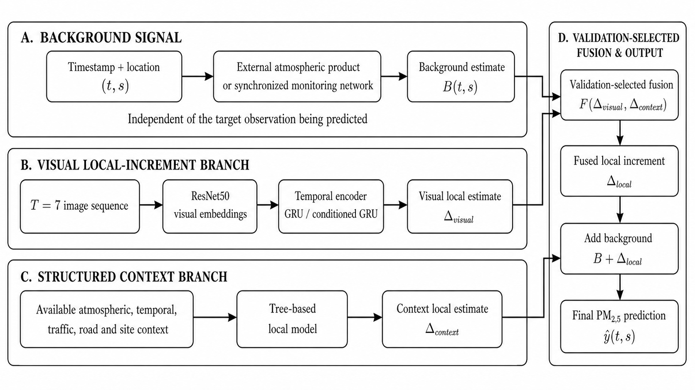

<div align="center">

# Roadside PM Visual Intelligence

### Leakage-aware, background-conditioned PM2.5 estimation from image sequences and environmental context

[](https://doi.org/10.5281/zenodo.22121571)
[](https://github.com/Kumaryan12/roadside-pm-visual-intelligence/releases/tag/v1.0.2-paper)
[](https://www.python.org/)
[](LICENSE)
[](docs/LICENSE.md)

**Computer vision · temporal modelling · environmental ML · grouped validation · leakage auditing**

[Manuscript](docs/environmental_modelling_software_submission_v1/main.pdf) ·
[LaTeX source](docs/environmental_modelling_software_submission_v1/main.tex) ·
[Release](https://github.com/Kumaryan12/roadside-pm-visual-intelligence/releases/tag/v1.0.2-paper) ·
[Zenodo record](https://doi.org/10.5281/zenodo.22121571)

</div>

---

## Overview

This repository accompanies the manuscript:

> **Auditing Temporal-Context Leakage in Image-Based PM2.5 Estimation: A
> Background-Conditioned Framework for Grouped Prediction**

Image-based PM2.5 studies commonly construct overlapping temporal windows and
then split those windows randomly. Adjacent seven-frame windows share six raw
frames, so nominally separate training and test sequences can contain almost
the same visual context. This repository audits that failure mode at the raw
frame level and evaluates a more deployment-oriented formulation:

```text
predicted PM2.5 = inference-time background + learned local refinement
```

The framework is evaluated independently on two public datasets:

- **TRAQID:** a mobile roadside campaign covering 20 dates and three seasons.
- **Taiwan surveillance network:** six fixed-camera monitoring sites covering
  276 dates in southern Kaohsiung.

The datasets share the background-plus-refinement principle, but they do not
share fitted weights. Their available backgrounds, local features and intended
deployment settings differ and are reported explicitly.

> [!IMPORTANT]
> The TRAQID random-window result is a diagnostic reproduction, not evidence
> of unseen-date generalization. In that split, 99.90% of test targets had
> already appeared as training context. Reportable transfer experiments isolate
> complete dates, chronological periods or complete monitoring sites before
> model selection and evaluation.

<p align="center">
  
</p>

---

## Main contributions

1. **Raw-frame leakage audit.** The project measures overlap between training,
   validation and test sequences instead of assuming that row-level separation
   implies independent evaluation.
2. **Grouped evaluation protocols.** Complete-date, chronological and nested
   leave-one-site-out splits align evaluation with intended temporal and
   spatial transfer.
3. **Background-conditioned estimation.** Broad pollution state is supplied
   through an inference-time atmospheric or monitoring-network background;
   learned visual and structured branches estimate a restrained local change.
4. **Inference-requirement accounting.** Every result states whether it needs
   atmospheric products, another monitor, other network sites or a short
   calibration period.
5. **Grouped uncertainty and sensitivity.** Date- or site-level resampling,
   non-overlapping-window checks, outage tests and per-group metrics accompany
   pooled scores.

---

## Headline results

### TRAQID: mobile roadside evaluation

| Protocol/model | N | MAE | RMSE | Pooled R² | Interpretation |
|---|---:|---:|---:|---:|---|
| Random T=7 conditional architecture | 3,983 | 5.36 | 10.29 | 0.950 | Contaminated diagnostic; 99.90% target/context leakage |
| 20-date MERRA-2 LODO | 26,558 | 28.53 | 42.14 | 0.188 | Zero-overlap, zero-shot complete-date evaluation |
| 16-date nearby-monitor LODO | 20,779 | 23.94 | 36.23 | 0.361 | Reference-assisted; only dates with monitor coverage |
| Future 90%, uncalibrated | 18,554 | 22.67 | 35.28 | 0.371 | Matched chronological baseline |
| **Future 90%, 10% meta-calibrated** | **18,554** | **21.04** | **31.77** | **0.490** | Assisted prediction after purged warm-up |

The chronological calibration uses the earliest 10% of each covered date,
purges every boundary sequence sharing a raw frame, and evaluates only the
later 90%. The mapping from early to later bias is learned from other dates.
It is suitable for sensor calibration or gap filling after warm-up, not
sensor-free prediction. Target-informed oracle scores of R²=0.582 and 0.663
are retained only as upper-bound diagnostics and are not deployable results.

### Taiwan: chronological and held-out-site evaluation

| Protocol/model | N | MAE | RMSE | Pooled R² | Status |
|---|---:|---:|---:|---:|---|
| Chronological other-site median | 7,180 | 4.704 | 6.613 | 0.690 | Frozen monitoring-network baseline |
| **Chronological complete estimator** | **7,180** | **4.580** | **6.442** | **0.706** | Frozen 54-date future-period test |
| Nested LOSO other-site median | 27,019 | 4.868 | 6.604 | 0.689 | Six outer held-out sites |
| **Nested LOSO conditioned-image estimator** | **27,019** | **4.818** | **6.460** | **0.702** | Inner-CV selection only |

For Taiwan, the target site's own observation is never part of its background.
The background is the synchronized median of other available sites at the same
hour. Dates are assigned before T=7 windows are constructed, producing zero
raw-frame overlap across chronological partitions. All six held-out sites had
positive site-wise R². The final image correction is small but statistically
measurable on the frozen chronological test.

### What these numbers do and do not establish

- The Taiwan results demonstrate network-assisted prediction within a
  synchronized six-site monitoring system; they are not camera-only transfer
  to a city without monitors.
- The TRAQID pooled scores include between-date variation. Mean, median and
  date-centred R² are reported in the manuscript because pooled R² alone can
  overstate within-date tracking.
- Rows with different coverage are not treated as paired comparisons.
- Random-window accuracy is useful for reproduction and debugging, but not for
  claims about future dates or unseen sites.

---

## Public datasets

| Dataset | Setting | Retained modelling data | Target | Primary grouping |
|---|---|---:|---|---|
| TRAQID | Mobile, front/rear roadside images; Hyderabad | 26,558 T=7 sequences, 20 dates, three seasons | Roadside PM2.5 | Complete date |
| Taiwan surveillance network | Six fixed cameras in southern Kaohsiung | 27,084 T=7 sequences, 276 dates | Station PM2.5 | Chronological date and complete site |

Sources:

- TRAQID: Kathalkar et al., *TRAQID - Traffic-Related Air Quality Image
  Dataset*, ICVGIP 2024, DOI
  [10.1145/3702250.3702260](https://doi.org/10.1145/3702250.3702260).
- Taiwan data: Wang et al., *Air quality estimation from sequential
  surveillance images using a unified CNN-RNN framework*, dataset DOI
  [10.17632/3hnztk9fk8.1](https://doi.org/10.17632/3hnztk9fk8.1).

The repository does not redistribute the raw images. Download each dataset
from its original provider and follow its current licence and citation terms.

### Background inputs

- **TRAQID atmospheric variants:** CAMS aerosol fields, MERRA-2 aerosol
  components and derived PM2.5, and ERA5-Land meteorology aligned by timestamp.
- **TRAQID assisted variant:** a contemporaneous OpenAQ/AirNow record located
  approximately 4.97 km from the campaign centre. Complete coverage existed
  for 16 of 20 dates; unmatched dates were not imputed.
- **Taiwan:** the contemporaneous median across other available network sites,
  excluding the target site exactly.

These are inference-time covariates, not alternative ground-truth labels.

---

## Model framework

### Shared decomposition

For target site or location `s` at time `t`:

```text
y_hat(t, s) = B(t, s) + Delta_hat(t, s)
```

- `B(t, s)` represents regional or monitoring-network background information
  that would be available at inference.
- `Delta_hat(t, s)` is learned from images and structured context.
- Traffic, road and atmospheric variables are covariates of one concentration;
  they are not separately added source masses.

### TRAQID instantiation

- T=7 front/rear image sequences.
- ImageNet ResNet50 global-average-pooling embeddings.
- GRU temporal representation and engineered multiscale summaries.
- Structured traffic, road, time, atmospheric and reference context.
- ExtraTrees/Random Forest/Ridge variants depending on the declared ablation.
- Complete-date LODO or purged first-10%-to-future-90% calibration.

### Taiwan instantiation

- T=7 fixed-camera image sequences.
- Frozen ResNet50 embeddings projected to 256 dimensions.
- Context-conditioned one-layer GRU, hidden width 128.
- Cross-fitted ExtraTrees context model trained on `target - background`.
- Bounded image correction and validation-selected shrinkage weight.
- Chronological test or nested leave-one-site-out selection.

---

## Validation protocols

| Protocol | Split unit | Raw-frame overlap | Intended interpretation |
|---|---|---:|---|
| Random sequence | Window | High | Same-distribution diagnostic only |
| Time-balanced purged | Time block | Zero | Temporal sensitivity |
| Complete-date LODO | Date | Zero | New-date transfer |
| Chronological train/validation/test | Ordered date | Zero | Later-period transfer |
| Nested LOSO | Monitoring site | Zero across outer sites | Within-network spatial transfer |
| First-10% calibration, future-90% test | Purged chronological segment | Zero | Assisted online calibration/gap filling |

A run with `n` consecutive frames produces `n - T + 1` windows when `n >= T`;
the number of frames does not need to be divisible by seven. Fair pipelines
assign groups before sequence construction or explicitly purge shared raw rows.

Every reportable comparison should include:

- MAE, RMSE, bias and pooled R²;
- per-date or per-site performance;
- the number of evaluated groups and rows;
- raw-frame overlap audit;
- background availability and inference requirements;
- grouped confidence intervals or sensitivity analysis where available.

---

## Repository contents

The repository includes:

- frame and timestamp alignment utilities;
- ResNet50, ConvNeXt-Tiny, MobileNetV2 and VGG16 embedding experiments;
- GRU/LSTM temporal models;
- YOLO traffic and SegFormer road-feature extraction;
- CAMS, MERRA-2, ERA5-Land, GEOS-CF and OpenAQ alignment workflows;
- TRAQID random, complete-date, reference-assisted and calibration analyses;
- Taiwan chronological and nested held-out-site pipelines;
- PM25Vision station/geographic/year holdout and encoder-adaptation studies;
- legacy MUMMA mobile-campaign experiments retained for provenance but not used
  in the released public-data manuscript;
- experiment/model registries, manuscript source and submission figures.

```text
configs/       Versioned pipeline and experiment configurations
data/          Schemas and manifest templates; downloaded datasets are ignored
docs/          Paper, reports, registries, figures and release notes
experiments/   Historical reproductions and experiment-specific workflows
models/        Registry and permitted small model assets
pipelines/     Dataset preparation, modelling and evaluation entry points
scripts/       Feature extraction, audits and legacy utilities
src/           Reusable Python package modules
tests/         Unit and integration tests
artifacts/     Generated runs, predictions and caches; ignored by Git
output/        Local compiled submission outputs; ignored by Git
```

Important entry points:

```text
pipelines/image_embeddings/traqid_final_architecture_random_diagnostic.py
pipelines/image_embeddings/traqid_lodo_multisource_hybrid.py
pipelines/image_embeddings/traqid_reference_innercv_lodo.py
pipelines/image_embeddings/traqid_chronological_calibration.py
pipelines/china_surveillance_aqi/build_taiwan_chronological_reference.py
pipelines/china_surveillance_aqi/train_conditioned_reference_gru.py
pipelines/china_surveillance_aqi/select_inner_alpha.py
pipelines/china_surveillance_aqi/bootstrap_conservative_visual_gain.py
```

---

## Installation

Python 3.11 was used for the released experiments.

```bash
git clone https://github.com/Kumaryan12/roadside-pm-visual-intelligence.git
cd roadside-pm-visual-intelligence

python3.11 -m venv .venv
source .venv/bin/activate
python -m pip install --upgrade pip
python -m pip install -e ".[all]"
python -m pip install pytest
```

Optional system dependencies:

- `ffmpeg`/`ffprobe` for video extraction;
- Tectonic for compiling the manuscript;
- Git LFS only when separately authorized large model assets are supplied;
- Google Earth Engine authentication for applicable atmospheric/geospatial
  workflows.

On macOS:

```bash
brew install ffmpeg tectonic
```

Basic checks:

```bash
python -m pytest -q
python -m pipelines.image_embeddings.traqid_chronological_calibration --help
python -m pipelines.china_surveillance_aqi.train_conditioned_reference_gru --help
```

---

## Reproducing the paper workflow

### 1. Use the archived version

For the exact released snapshot:

```bash
git fetch --tags
git checkout v1.0.2-paper
```

The versioned source is archived at
[DOI 10.5281/zenodo.22121571](https://doi.org/10.5281/zenodo.22121571).

### 2. Obtain the source datasets

Download TRAQID and the Taiwan surveillance dataset from their original
providers. Raw media, model weights, embeddings, atmospheric caches and
per-row prediction files are excluded from Git. Reproduction therefore
requires reconstructing the documented local paths or updating CLI arguments
to point to equivalent authorized inputs.

### 3. Inspect each CLI before execution

```bash
python -m pipelines.image_embeddings.traqid_final_architecture_random_diagnostic --help
python -m pipelines.image_embeddings.traqid_lodo_multisource_hybrid --help
python -m pipelines.image_embeddings.traqid_reference_innercv_lodo --help
python -m pipelines.image_embeddings.traqid_chronological_calibration --help

python -m pipelines.china_surveillance_aqi.build_taiwan_chronological_reference --help
python -m pipelines.china_surveillance_aqi.train_conditioned_reference_gru --help
python -m pipelines.china_surveillance_aqi.select_inner_alpha --help
python -m pipelines.china_surveillance_aqi.bootstrap_conservative_visual_gain --help
```

Do not mix manifests, embeddings or backgrounds from different datasets or
protocols. Preserve stable row IDs, timestamps, site/date groups and raw-frame
membership through every stage.

### 4. Verify provenance

Generated runs normally contain:

```text
artifacts/runs/<run-id>/
├── run.json / manifest.json
├── run.log
├── split and overlap audits
├── metrics*.csv / metrics*.json
├── feature manifests
└── predictions and checkpoints
```

The manuscript's provenance appendix records the selected artifacts and
whether each result is diagnostic, grouped, assisted, frozen or exploratory.
Tracked registries provide additional navigation:

- [Experiment registry](docs/experiment_registry.csv)
- [PM2.5 model registry](docs/pm25_model_registry.csv)
- [Architecture registry](docs/model_architecture_registry.csv)
- [Model registry](models/registry.csv)
- [Data lineage](docs/data_lineage.md)

### 5. Compile the manuscript

```bash
mkdir -p build/ems_submission
tectonic --outdir build/ems_submission \
  docs/environmental_modelling_software_submission_v1/main.tex
```

Submission material is under
[`docs/environmental_modelling_software_submission_v1/`](docs/environmental_modelling_software_submission_v1/),
including LaTeX, bibliography, grayscale/color figures, graphical abstract,
highlights, cover letter and checklist.

---

## Reproducibility and data governance

- Raw imagery and third-party environmental data remain under provider terms.
- No credential, API token, private GPS trace or restricted raw dataset should
  be committed.
- PM/OPC target channels must not be used as predictors in reportable PM2.5
  experiments unless the task explicitly permits sensor-assisted calibration.
- A monitoring-network background must exclude the target site's simultaneous
  observation.
- Select models, weights and calibration parameters using training/validation
  groups only; never outer-test targets.
- Retain the split manifest and raw-frame overlap audit for every sequence run.
- Report inference-time data requirements and missing-background coverage.
- Do not call traffic/road features chemical source apportionment.

See [THIRD_PARTY_DATA.md](THIRD_PARTY_DATA.md) for third-party resource terms.

---

## Scope and limitations

- TRAQID complete-date performance remains sensitive to date-level background
  shifts; pooled R² does not imply uniformly positive within-date R².
- TRAQID local-reference results cover 16 of 20 dates and are explicitly
  reference-assisted.
- The calibration-assisted TRAQID model requires a roadside target sensor
  during the first 10% of a new drive.
- Taiwan predictions require synchronized observations from other sites in the
  same monitoring network.
- The Taiwan test is retrospective and within one regional network; unseen-city
  transfer has not been established.
- Sparse high-concentration observations remain more difficult than the central
  pollution range.
- Oracle analyses use target information and are ceilings, never deployable
  model results.

---

## Paper and release

- Manuscript PDF: [main.pdf](docs/environmental_modelling_software_submission_v1/main.pdf)
- Manuscript source: [main.tex](docs/environmental_modelling_software_submission_v1/main.tex)
- Submission checklist: [submission_checklist.md](docs/environmental_modelling_software_submission_v1/submission_checklist.md)
- GitHub release: [v1.0.2-paper](https://github.com/Kumaryan12/roadside-pm-visual-intelligence/releases/tag/v1.0.2-paper)
- Version-independent archive DOI: [10.5281/zenodo.22121571](https://doi.org/10.5281/zenodo.22121571)

The DOI identifies the immutable paper-release snapshot. The `main` branch may
contain later documentation or maintenance changes.

---

## Citation

Machine-readable metadata is provided in [`CITATION.cff`](CITATION.cff).

```bibtex
@software{kumar2026roadside,
  author  = {Kumar, Aryan Satyendra},
  title   = {Roadside PM Visual Intelligence: leakage-aware
             background-conditioned PM2.5 estimation},
  version = {v1.0.2-paper},
  year    = {2026},
  doi     = {10.5281/zenodo.22121571},
  url     = {https://doi.org/10.5281/zenodo.22121571}
}
```

When citing a numerical result, also state the dataset, test population,
grouping protocol, background source and whether the result is diagnostic,
assisted, frozen or exploratory.

---

## Licence

- Code, scripts and configurations: [MIT License](LICENSE).
- Original manuscript, documentation, tables and figures under `docs/`:
  [CC BY 4.0](docs/LICENSE.md), unless otherwise noted.
- Third-party data, imagery, atmospheric products, maps and pretrained weights:
  their original provider terms; they are not relicensed here.
