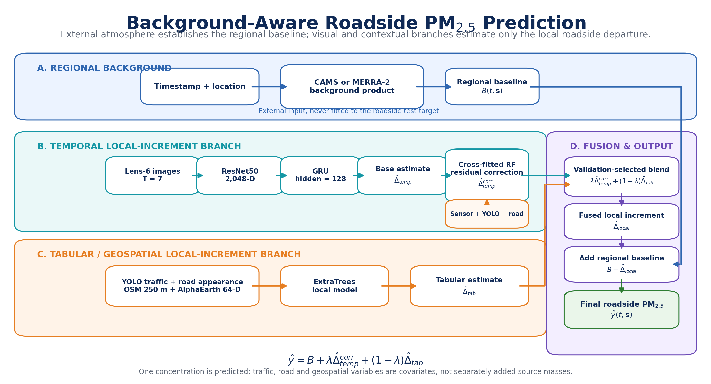

# Roadside PM Visual Intelligence

Multimodal roadside PM2.5 estimation from synchronized vehicle-mounted images,
environmental sensors, traffic and road features, geospatial context, and
external atmospheric products.

**Repository:** [Kumaryan12/roadside-pm-visual-intelligence](https://github.com/Kumaryan12/roadside-pm-visual-intelligence)<br>
**Full internship report:** [PDF](docs/internship_report/internship_report.pdf) ·
[LaTeX source](docs/internship_report/internship_report.tex)<br>
**Experiment consolidation:** [PM2.5 model summary](docs/pm25_experiment_consolidation.md) ·
[architecture catalog](docs/model_architecture_catalog.md)

> [!IMPORTANT]
> High random-split scores in this project are **diagnostic results**, not
> evidence of future-date generalization. Overlapping temporal windows place
> nearly identical raw frames in different partitions. The main scientific
> evaluation withholds complete collection dates.



## Project overview

A roadside PM2.5 observation contains pollution transported into the region as
well as a local departure associated with the immediate road environment. The
current model therefore uses the decomposition

```text
roadside PM2.5 = external regional background + learned local increment
```

The external background is obtained from CAMS or MERRA-2 without fitting it to
the roadside target. Two complementary branches estimate the local increment:

1. A **temporal branch** encodes a seven-frame lens-6 image sequence with a
   frozen ResNet50 and a GRU. A cross-fitted Random Forest uses sensor,
   meteorological, traffic, and road features to correct its residual.
2. A **tabular/geospatial branch** uses ExtraTrees with YOLO traffic, road
   appearance, OSM, and AlphaEarth features.
3. A convex temporal/tabular weight is selected using validation RMSE only.
   The external background is then added back to obtain total roadside PM2.5.

The traffic, road, and OSM variables are predictive covariates for the local
departure. They are **not** interpreted as independently measured source
masses. PM and OPC channels are excluded from reportable PM2.5 predictors.

## What the repository contains

- Ingestion and timestamp alignment for MUMMA/ELICIUS sensor and video data.
- Lens-aware frame extraction and preprocessing.
- IDD-trained YOLO vehicle detection and aggregation.
- SegFormer road segmentation and road appearance features.
- Experimental monocular-depth road-area estimation.
- ResNet50, ConvNeXt-Tiny, and MobileNetV2 image embeddings.
- GRU/LSTM temporal sequence models.
- OSM 250 m corridor features and AlphaEarth annual embeddings.
- CAMS, MERRA-2, and ERA5 atmospheric feature extraction.
- Direct, background-plus-increment, residual-correction, early-fusion, and
  nested-ensemble experiments.
- Random-row, random-sequence, whole-date, and nested validation protocols.
- TRAQID historical reproduction and MUMMA five-day experiments.
- Exploratory particle-regime and source-proxy analyses.
- A complete LaTeX internship report with presentation-ready figures.

## Current results

### Five-day MUMMA whole-date evaluation

The table below pools the outer-test predictions from five complete-date
holdouts. Pooled R² includes between-date variation, so it must be read
together with the per-date results. Mean per-date R² remains negative.

| Framework | Evaluation role | N | MAE (µg/m³) | RMSE (µg/m³) | Pooled R² |
|---|---|---:|---:|---:|---:|
| MERRA-2 ensemble, fixed 50:50 | Diagnostic ensemble weight | 6,543 | 21.985 | 34.589 | 0.566 |
| MERRA-2 + tabular local increment | Standalone fair branch | 6,873 | 23.485 | 35.007 | 0.550 |
| **MERRA-2 ensemble, validation-selected** | **Primary selection-valid candidate** | **6,543** | **22.580** | **35.689** | **0.538** |
| CAMS ensemble, fixed 50:50 | Diagnostic ensemble weight | 6,543 | 25.275 | 38.288 | 0.468 |
| CAMS ensemble, validation-selected | Earlier selection-valid candidate | 6,543 | 25.281 | 38.666 | 0.457 |
| Direct image + residual correction | No atmospheric decomposition | 6,543 | 32.820 | 47.335 | 0.187 |
| Direct complete tabular model | YOLO + road + OSM + AlphaEarth | 6,873 | 34.960 | 47.740 | 0.163 |

The fixed 50:50 MERRA-2 ensemble has the best pooled diagnostic score, but the
validation-selected MERRA-2 ensemble is the defensible current candidate. The
architecture was developed using these five dates and remains exploratory
until it is frozen and evaluated once on untouched future dates.

### Random-window diagnostics

| Dataset/model | MAE | RMSE | R² | Interpretation |
|---|---:|---:|---:|---|
| Historical TRAQID ResNet50-GRU + clipped ExtraTrees | 4.212 | 8.717 | 0.966 | Overlapping random-window benchmark |
| MUMMA two-day smoothed T=7 target | 3.875 | 6.033 | 0.958 | Smoothed target and 99.27% target/context leakage |
| MUMMA five-day ConvNeXt-Tiny-GRU + sensor/visual RF | 8.951 | 18.537 | 0.867 | Random sequence diagnostic |
| MUMMA five-day CAMS + ResNet50-GRU + OSM correction | 9.787 | 19.897 | 0.847 | Random sequence diagnostic |

For the five-day T=7 random-sequence protocol, 1,287 of 1,309 test targets had
already appeared as training context: 98.32% target/context leakage.

## Data used

### MUMMA five-day collection

- Dates: 1–5 February 2026.
- 6,873 aligned ten-second sensor observations from 55 runs.
- 20,619 preprocessed images: one image for each of lenses 1, 2, and 6.
- 136,534 detected PM-relevant road users.
- 25 OSM predictors within 250 m.
- 64 AlphaEarth annual embedding dimensions.
- Hourly-aligned external CAMS, MERRA-2, and ERA5 variables.
- Target: sensor PM2.5 (`sPM2`).

### TRAQID historical benchmark

- 26,558 T=7 image sequences.
- Front and rear views.
- Historical random-window benchmark and later complete-date holdouts.

Raw sensor data, videos, extracted frames, large embeddings, caches, trained
weights, and run artifacts are intentionally not committed. A fresh clone
contains the code, configuration templates, schemas, selected small model
assets, documentation, and report. Reproducing numerical results requires
authorized access to the corresponding raw data or archived artifacts.

## Feature families

The canonical five-day feature membership is stored in
`artifacts/runs/mumma_5day_complete_nonpm_models_v1/feature_groups.json` after
the feature table is built.

| Family | Count | Description |
|---|---:|---|
| Sensor/met/gas/time/mobility | 24 | Temperature, humidity, gas indices, trace gases, cyclic time, GPS, speed, course, and HDOP |
| YOLO traffic | 58 | Counts, traffic composition, confidence, box area, occupancy, and exhaust/resuspension proxies |
| Road appearance | 45 | Segmented road area, brightness, saturation, contrast, shadow, glare, dry/brown pixels, edges, texture, and haze |
| Road depth/metric area | 16 | Monocular-depth and cleaned-mask diagnostics; provisional |
| OSM | 25 | Nearby activity/POI counts and road-network hierarchy within 250 m |
| AlphaEarth | 64 | Annual latent embedding dimensions A00–A63 |

Composite groups include:

- `visual_yolo_road`: 103 predictors
- `sensor_plus_visual`: 127 predictors
- `visual_yolo_road_osm_alphaearth`: 192 predictors
- `sensor_plus_visual_osm_alphaearth`: 216 predictors

The reportable groups do not include PM1, PM2.5, PM4, PM10, OPC number
channels, or `sTPS`.

## Repository layout

```text
configs/       Versioned pipeline and source-profile configurations
data/          Schemas and manifest templates; raw datasets are ignored
docs/          Methods, registries, architecture catalog, and internship report
experiments/   Historical reproductions and experiment-specific workflows
models/        Model registry and selected small/versioned model assets
pipelines/     Canonical end-to-end and modeling entry points
scripts/       Component extraction, preprocessing, audit, and legacy scripts
src/           Reusable package modules
tests/         Unit and integration tests
artifacts/     Generated run outputs and caches; ignored by Git
```

The main entry points are under `pipelines/`. Scripts under `scripts/` and
`experiments/` remain available for component-level reproduction and historical
provenance.

## Installation

### 1. Clone

```bash
git clone https://github.com/Kumaryan12/roadside-pm-visual-intelligence.git
cd roadside-pm-visual-intelligence
```

### 2. Create an environment

Python 3.11 was used for the final experiments; the package declares Python
3.9 or newer.

```bash
python3.11 -m venv .venv
source .venv/bin/activate
python -m pip install --upgrade pip
python -m pip install -e ".[all]"
python -m pip install pytest
```

For a minimal tabular-only installation:

```bash
python -m pip install -e .
```

### 3. Install external tools

- `ffmpeg` and `ffprobe` for video/frame extraction.
- Git LFS if large model assets are supplied through an external LFS archive.
- A LaTeX engine such as Tectonic to rebuild the internship report.
- Google Earth Engine authentication for AlphaEarth and atmospheric products.

On macOS:

```bash
brew install ffmpeg tectonic
```

### 4. Provide model assets

The road SegFormer checkpoint and its configuration are versioned under
`models/road_segmentation/`. The IDD YOLO detector is not distributed with the
repository. Place the authorized checkpoint at the path configured in
`configs/pipelines/feature_table_v1.yaml`, conventionally:

```text
models/detectors/yolo11m_idd15_v1_best.pt
```

Do not silently substitute a COCO detector: its labels and traffic mapping are
not equivalent to the IDD-trained model.

### 5. Verify the environment

```bash
python -m pipelines.shared.feature_table.run --help
python -m pipelines.pm25_prediction.mumma_7day.run_background_local_increment --help
python -m pytest -q
```

## Data preparation

### Expected manifest

Start from:

```text
data/manifests/mumma_7day_collections.template.csv
```

Each collection must identify the date/run, sensor source, video source,
camera/lens, and synchronization metadata. Preserve stable `sample_id` values
through every stage.

### Prepare an ELICIUS delivery

The following example resamples sensor streams to ten seconds and discovers
videos for lenses 1, 2, and 6:

```bash
PYTHONUNBUFFERED=1 python \
  -m pipelines.pm25_prediction.mumma_7day.prepare_elicius \
  --ssd-root /Volumes/ELICIUS \
  --output-dir artifacts/runs/mumma_5day_ingestion_lenses_1_2_6_v1 \
  --interval-seconds 10 \
  --lenses 1 2 6 \
  --dates 2026-02-01 2026-02-02 2026-02-03 2026-02-04 2026-02-05
```

Extract timestamp-aligned frames:

```bash
PYTHONUNBUFFERED=1 python \
  -m pipelines.pm25_prediction.mumma_7day.extract_frames \
  --sensor-csv artifacts/runs/mumma_5day_ingestion_lenses_1_2_6_v1/sensor_10s.csv \
  --video-manifest artifacts/runs/mumma_5day_ingestion_lenses_1_2_6_v1/video_manifest_lenses_1_2_6.csv \
  --output-root artifacts/runs/mumma_5day_frames_lenses_1_2_6_v1 \
  --lenses 1 2 6 \
  --workers 6
```

Use `--help` before running a command if your delivery layout differs.

## Canonical feature workflow

### 1. Configure and preflight

Copy or edit `configs/pipelines/feature_table_v1.yaml`. Its checked-in paths
are examples and include machine-specific placeholders. Set:

- sensor and video/manifest paths;
- output run ID and artifact root;
- IDD YOLO and SegFormer checkpoint paths;
- lens/camera parameters;
- Earth Engine project, if geospatial extraction is enabled.

Then inspect the execution plan without writing outputs:

```bash
python -m pipelines.shared.feature_table.run \
  --config configs/pipelines/feature_table_v1.yaml \
  --preflight

python -m pipelines.shared.feature_table.run \
  --config configs/pipelines/feature_table_v1.yaml \
  --dry-run \
  --to-stage segment_road_features
```

### 2. Run or resume the feature table

```bash
python -m pipelines.shared.feature_table.run \
  --config configs/pipelines/feature_table_v1.yaml \
  --run-id mumma_5day_feature_table_v1

python -m pipelines.shared.feature_table.run \
  --config configs/pipelines/feature_table_v1.yaml \
  --run-id mumma_5day_feature_table_v1 \
  --resume
```

The staged workflow covers frame extraction, lens preprocessing, vehicle
detection, road segmentation, optional road area/depth, visual aggregation,
OSM, and AlphaEarth merging. Each run records stage status and provenance under
`artifacts/runs/<run-id>/`.

### 3. Extract OSM corridor context

OSM extraction uses cached Overpass tiles and performs the final 250 m radius
filter locally. A final CSV is written only after every required tile succeeds;
rerunning the same command retries failed tiles and reuses successful ones.

```bash
PYTHONUNBUFFERED=1 PYTHONPATH=src python \
  -m pipelines.shared.extract_osm_corridor_features \
  --sensor-csv artifacts/runs/mumma_5day_combined_lenses_1_2_6_v1/sensor_10s.csv \
  --output-csv artifacts/runs/mumma_5day_geospatial_corridor_v1/osm_250m.csv \
  --cache-dir artifacts/cache/osm/mumma_5day_corridor_tiles_002deg \
  --lat-col lat \
  --lon-col long \
  --sample-col sample_id \
  --radius-m 250 \
  --round-decimals 3 \
  --tile-degrees 0.02 \
  --endpoint https://overpass.private.coffee/api/interpreter \
  --request-timeout-seconds 180 \
  --request-retries 2 \
  --delay-seconds 3
```

### 4. Extract AlphaEarth features

Authenticate once and use a Google Earth Engine project with the required
quota:

```bash
earthengine authenticate

PYTHONUNBUFFERED=1 python \
  -m pipelines.shared.extract_alphaearth_features_batched \
  --sensor-csv artifacts/runs/mumma_5day_combined_lenses_1_2_6_v1/sensor_10s.csv \
  --output-csv artifacts/runs/mumma_5day_geospatial_alphaearth_v1/alphaearth_2025_point.csv \
  --cache-json artifacts/cache/alphaearth/mumma_5day_2025_point_round5.json \
  --project YOUR_EARTH_ENGINE_PROJECT
```

AlphaEarth dimensions are latent features; they must not be relabeled as
directly observed land-cover quantities.

### 5. Extract CAMS, MERRA-2, and ERA5 context

```bash
PYTHONUNBUFFERED=1 python \
  -m pipelines.shared.extract_atmospheric_background \
  --sensor-csv artifacts/runs/mumma_5day_combined_lenses_1_2_6_v1/sensor_10s.csv \
  --output-csv artifacts/runs/mumma_5day_atmospheric_background_v1/background_hourly.csv \
  --cache-json artifacts/cache/atmosphere/mumma_5day_background.json \
  --timestamp-col sample_timestamp \
  --sample-col sample_id \
  --lat-col lat \
  --lon-col long \
  --timezone Asia/Kolkata \
  --project YOUR_EARTH_ENGINE_PROJECT
```

The extractor uses the route centroid and causal time matching. CAMS is matched
to its three-hour analysis/forecast cycle; MERRA-2 and ERA5 variables are
hourly. These products provide regional atmospheric context, not a direct
roadside sensor measurement.

## Model reproduction

The commands below assume the five-day feature table, atmospheric table,
whole-date split manifests, and ResNet50 embeddings already exist. Replace
paths only if you intentionally create a new run; do not mix two-day and
five-day artifacts.

### 1. Standalone MERRA-2 tabular local-increment model

```bash
mkdir -p artifacts/runs/mumma_5day_merra2_local_osm_alphaearth_fair_v1

PYTHONUNBUFFERED=1 PYTHONPATH=src python \
  -m pipelines.pm25_prediction.mumma_7day.run_background_local_increment \
  --modeling-table artifacts/runs/mumma_5day_complete_nonpm_models_v1/modeling_table.csv \
  --feature-groups artifacts/runs/mumma_5day_complete_nonpm_models_v1/feature_groups.json \
  --background-csv artifacts/runs/mumma_5day_atmospheric_background_v1/background_hourly.csv \
  --background-col background_merra2_pm25_ug_m3 \
  --output-dir artifacts/runs/mumma_5day_merra2_local_osm_alphaearth_fair_v1 \
  --target sPM2 \
  --local-feature-sets visual_yolo_road_osm_alphaearth \
  --seed 42 \
  2>&1 | tee artifacts/runs/mumma_5day_merra2_local_osm_alphaearth_fair_v1/run.log
```

### 2. Fair MERRA-2 temporal local-increment model

```bash
PYTHONUNBUFFERED=1 PYTHONPATH=src python \
  -m pipelines.image_embeddings.run_background_increment_fair \
  --source-ladder artifacts/runs/mumma_5day_image_ladder_T7_gru_v1 \
  --background-csv artifacts/runs/mumma_5day_atmospheric_background_v1/background_hourly.csv \
  --embedding-index artifacts/runs/mumma_5day_image_ladder_T7_gru_v1/embeddings/lens6_index.csv \
  --embeddings artifacts/runs/mumma_5day_image_ladder_T7_gru_v1/embeddings/lens6_resnet50.npy \
  --output-dir artifacts/runs/mumma_5day_resnet_gru_T7_merra2_increment_fair_v1 \
  --view lens6 \
  --sequence-length 7 \
  --cell gru \
  --target sPM2 \
  --background-col background_merra2_pm25_ug_m3 \
  --seed 42 \
  --device auto
```

### 3. Produce temporal residual-correction candidates

```bash
mkdir -p artifacts/runs/mumma_5day_resnet_gru_T7_merra2_residual_fair_v1

PYTHONUNBUFFERED=1 PYTHONPATH=src python \
  -m pipelines.pm25_prediction.mumma_7day.run_residual_fusion_current_data \
  --ladder-dir artifacts/runs/mumma_5day_resnet_gru_T7_merra2_increment_fair_v1 \
  --tabular-run-dir artifacts/runs/mumma_5day_complete_nonpm_models_v1 \
  --output-dir artifacts/runs/mumma_5day_resnet_gru_T7_merra2_residual_fair_v1 \
  --base-view lens6 \
  --base-sequence-length 7 \
  --base-cell gru \
  --target sPM2 \
  --random-state 42 \
  2>&1 | tee artifacts/runs/mumma_5day_resnet_gru_T7_merra2_residual_fair_v1/run.log
```

This runner reports several residual candidates for research comparison. The
final nested ensemble below pre-specifies `sensor_plus_visual` with Random
Forest and performs its validation correction cross-fitting by run; it does
not select that correction using the outer-test target.

### 4. Nested temporal-tabular ensemble

This stage requires the fair temporal ladder, the temporal residual run, and
the standalone tabular local run:

```bash
mkdir -p artifacts/runs/mumma_5day_nested_merra2_ensemble_osm_fair_v1

PYTHONUNBUFFERED=1 PYTHONPATH=src python \
  -m pipelines.pm25_prediction.mumma_7day.run_nested_background_ensemble \
  --temporal-ladder artifacts/runs/mumma_5day_resnet_gru_T7_merra2_increment_fair_v1 \
  --temporal-residual-run artifacts/runs/mumma_5day_resnet_gru_T7_merra2_residual_fair_v1 \
  --tabular-local-run artifacts/runs/mumma_5day_merra2_local_osm_alphaearth_fair_v1 \
  --modeling-table artifacts/runs/mumma_5day_complete_nonpm_models_v1/modeling_table.csv \
  --feature-groups artifacts/runs/mumma_5day_complete_nonpm_models_v1/feature_groups.json \
  --output-dir artifacts/runs/mumma_5day_nested_merra2_ensemble_osm_fair_v1 \
  --background-col background_merra2_pm25_ug_m3 \
  --target sPM2 \
  --view lens6 \
  --sequence-length 7 \
  --cell gru \
  --temporal-feature-set sensor_plus_visual \
  --temporal-correction-model random_forest \
  --tabular-feature-set visual_yolo_road_osm_alphaearth \
  --tabular-model extra_trees \
  --inner-group-folds 5 \
  --seed 42 \
  2>&1 | tee artifacts/runs/mumma_5day_nested_merra2_ensemble_osm_fair_v1/run.log
```

Use `--interval-alpha 0.1` to emit validation-calibrated symmetric conformal
intervals. Outer-test targets are not used to calibrate the interval or select
the ensemble weight.

## Validation protocols

| Protocol | Purpose | Generalization claim |
|---|---|---|
| Random row | Same-distribution tabular diagnostic | No |
| Random sequence after window construction | Historical comparison and debugging | No; overlapping context leakage |
| Whole-date outer holdout | Stress test on an unseen collection date | Fair exploratory evaluation |
| Nested whole-date validation | Select correction model/ensemble weight without outer-test targets | Current preferred protocol |

For temporal models, windows are grouped by `run_id`; fair sequences never
cross a run or day boundary. A run with `n` frames produces `n - T + 1`
overlapping T-frame windows when `n >= T`; no divisibility by seven is
required.

Always report:

- pooled outer-test MAE, RMSE, R², and bias;
- metrics for every held-out date and their mean/worst case;
- random-window overlap audit, where applicable;
- extreme-event/inlier metrics;
- interval coverage when uncertainty is produced.

## Generated outputs and provenance

Runs normally create:

```text
artifacts/runs/<run-id>/
├── run.json or manifest.json
├── run.log
├── metrics*.csv / metrics*.json
├── predictions*.csv
├── models/
└── intermediate feature tables
```

The exact output contract varies by pipeline. `run.json`, split manifests,
feature lists, and metrics are the minimum provenance needed to interpret a
result. Do not compare metrics unless dataset, target, split protocol, feature
group, and test population all match.

Large generated artifacts are ignored by Git. The tracked registries index the
historical experiments:

- [PM2.5 model registry](docs/pm25_model_registry.csv)
- [architecture registry](docs/model_architecture_registry.csv)
- [model registry](models/registry.csv)
- [data lineage](docs/data_lineage.md)

## Rebuilding the internship report

The report source and its selected figures are tracked:

```bash
cd docs/internship_report
tectonic internship_report.tex
```

The resulting `internship_report.pdf` includes the project chronology,
architecture, feature engineering, validation protocols, ablations, results,
limitations, and future work.

## Exploratory source-attribution work

`pipelines/particle_source_attribution/` contains:

- neutral NMF source-proxy components;
- assumption-conditioned scenario sensitivity;
- directly derived particle-size regime targets.

These outputs are **not chemical source apportionment**. Source identities and
mass contributions require differential OPC bins, confirmed units, and
chemical reference/speciation evidence such as FTIR. Do not label latent
components as exhaust, dust, or secondary aerosol without that evidence.

## Reproducibility and data governance

- Raw videos and sensor files are external, access-controlled inputs.
- GPS trajectories may be sensitive; review them before sharing.
- Earth Engine, Overpass, and atmospheric responses are cached locally but are
  not committed.
- Model weights must be redistributed only when their dataset and license
  permit it.
- Never commit credentials, Earth Engine tokens, mounted-volume paths, or
  private per-row predictions.
- Paths under `artifacts/` in documentation record experiment provenance; they
  are not guaranteed to exist in a fresh clone.
- Set random seeds, retain split manifests, and record software/hardware
  versions for every new experiment.

## Known limitations

- Only five MUMMA collection dates were available for the main study.
- Whole-date distribution shift remains substantial; mean per-date R² is
  negative.
- Extreme PM2.5 transitions dominate RMSE and require one-second sensor/video
  timing validation.
- The depth-derived metric road area is provisional and did not improve the
  final models.
- AlphaEarth variables are latent and not physically named measurements.
- OSM provided interpretable context but did not consistently improve the fair
  nested ensemble.
- CAMS/MERRA-2 are coarse regional products, not street-scale PM2.5 truth.
- The current candidate must be frozen and tested on untouched future dates
  before a deployment claim.

## Documentation

- [Complete internship report](docs/internship_report/internship_report.pdf)
- [PM2.5 experiment consolidation](docs/pm25_experiment_consolidation.md)
- [Architecture catalog](docs/model_architecture_catalog.md)
- [System architecture notes](docs/architecture.md)
- [Feature definitions](docs/feature_definitions.md)
- [Data lineage](docs/data_lineage.md)
- [Complete presentation export](docs/complete_project_export_for_presentation.md)

## License and citation

No open-source license file is currently included. The public repository can
be inspected and cited, but reuse or redistribution should not be assumed to
be licensed until the repository owner adds an explicit license. External
datasets, APIs, and pretrained checkpoints retain their own terms.

Suggested project citation:

```bibtex
@software{satyendrakumar2026roadsidepm,
  author = {Aryan Satyendra Kumar},
  title = {Roadside PM Visual Intelligence},
  year = {2026},
  url = {https://github.com/Kumaryan12/roadside-pm-visual-intelligence}
}
```

When reporting a numerical result, cite the corresponding run manifest and
state the dataset, split protocol, target, feature group, and whether the
result is exploratory or confirmatory.
